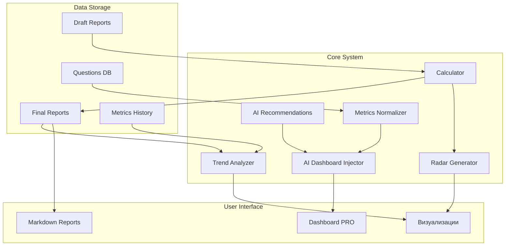

# Архитектура системы HPI

## Общая схема

## Компоненты системы

### User Interface
- **Markdown Reports**: Интерфейс для создания и редактирования отчетов в формате Markdown
- **Dashboard PRO**: Интерактивный дашборд с визуализацией метрик, рекомендациями и нормализованными данными
- **Визуализации**: Радарные диаграммы и графики трендов

### Core System
- **Calculator**: Модуль расчета HPI и метрик по сферам (`calculator.py`)
- **Radar Generator**: Генератор радарных диаграмм (`radar.py`)
- **Trend Analyzer**: Анализатор трендов и динамики показателей (`trend.py`)
- **AI Recommendations**: Движок для генерации рекомендаций (`ai_recommendations.py`)
- **AI Dashboard Injector**: Инжектор данных в PRO-дашборд (`ai_dashboard_injector.py`)
- **Metrics Normalizer**: Нормализация и стандартизация метрик

### Data Storage
- **Draft Reports**: Черновики отчетов в `reports_draft/`
- **Final Reports**: Финальные отчеты в `reports_final/`
- **Questions DB**: База вопросов и метрик в `database/questions.md`
- **Metrics History**: История изменения метрик пользователя

## Потоки данных

1. Пользователь создает черновик отчета в Markdown формате
2. Калькулятор обрабатывает данные и создает финальный отчет
3. Генератор радарных диаграмм создает визуализации
4. Анализатор трендов отслеживает динамику показателей
5. Нормализатор метрик стандартизирует названия и значения
6. AI-рекомендации анализируют данные и генерируют советы
7. AI-инжектор обновляет PRO-дашборд

## Технологический стек

- Python 3.8+
- Markdown для отчетов
- JSON для структурированных данных
- Matplotlib для визуализаций
- Git для версионирования 

## Как расширять систему

- **Добавление новой метрики:**
  1. Добавьте описание метрики и вопросы в `database/questions.md`.
  2. Обновите калькулятор (`src/calculator.py`), если требуется особая обработка.
  3. Проверьте отображение в дашборде и визуализациях.

- **Добавление нового AI-провайдера:**
  1. Реализуйте новый модуль в `src/ai_providers/` (создайте папку, если её нет).
  2. Добавьте обработку в `ai_dashboard_injector.py`.
  3. Протестируйте интеграцию и fallback на OpenAI.

- **Интеграция с внешними сервисами:**
  1. Создайте отдельный модуль-интегратор в `src/integrations/`.
  2. Опишите схему данных и настройте обмен.
  3. Добавьте описание интеграции в документацию.

## Безопасность и работа с секретами

- Все ключи и пароли должны храниться только в `.env` или менеджере секретов (Vault, AWS Secrets, etc).
- Не коммитьте `.env` и другие файлы с секретами в репозиторий.
- Для тестов используйте отдельные тестовые ключи.
- Регулярно делайте бэкапы базы данных и отчетов.
- Используйте инструменты для анализа зависимостей на уязвимости (Dependabot, Safety).

## Краткий гайд по деплою

1. Клонируйте репозиторий и создайте виртуальное окружение.
2. Установите зависимости: `pip install -r requirements.txt`.
3. Настройте переменные окружения (`.env`).
4. Запустите миграции (если появятся).
5. Для продакшена используйте Docker Compose (пример в `deploy/docker-compose.yml`).
6. Проверьте логи и корректность работы дашборда.
7. Для CI/CD настройте автоматический деплой на сервер (GitHub Actions, GitLab CI). 