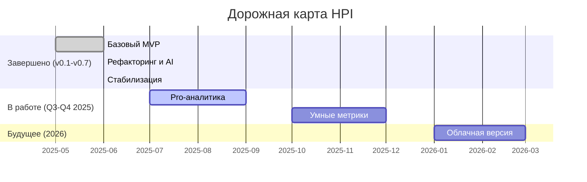

---
cssclasses:
  - hpi-doc
version: "0.7.0"
release_date: 2025-06-23
status: Stable
---

# 📅 Дорожная карта развития HPI

> **Версия:** 0.7.0  
> **Статус:** Стабильная версия, ведется работа над Pro-функционалом.

---

## 🚀 Основные этапы

Ниже представлена визуализация ключевых этапов разработки проекта.



---

## 🏆 История релизов: от MVP до стабильной версии

> [!NOTE] Здесь задокументирован путь развития HPI с самой первой версии.

### v0.7: Стабилизация и исправление данных
- **Ключевое исправление:** Устранена главная ошибка с расчетом HPI (3 метрики вместо 5).
- **Чистка данных:** Обновлены все исторические отчеты под новый формат.

### v0.6: Работа над ошибками
- Восстановлена работа AI-рекомендаций после рефакторинга.
- Улучшена обработка ошибок API и нормализация метрик.

### v0.5: Автоматизация и UX
- **Упрощение работы:** Добавлен скрипт для автоматического создания черновиков.
- **Стандартизация:** Введена единая система именования файлов.
- **Критический фикс:** Исправлена ошибка парсинга, из-за которой дашборд был пустым.

### v0.4: AI и рефакторинг
- **Первая версия AI:** Добавлен базовый модуль AI-рекомендаций.
- **Масштабный рефакторинг:** Структура проекта полностью переработана, код перенесен в `src`.
- **Централизация:** Улучшено управление логами и артефактами.

### v0.3: PRO-версия
- **Новый формат:** Реализован компактный PRO-формат с иконками и улучшенным стилем.

### v0.2: Визуализация и ядро
- **Рабочий калькулятор:** Внедрена нелинейная шкала Фибоначчи.
- **Динамический дашборд:** Добавлены радарные диаграммы и графики тренда.

### v0.1: MVP
- **Первый релиз:** Базовый расчет HPI и генерация Markdown-отчетов.

---

## 🎯 Детализация будущих этапов

### I. Pro-аналитика и умные метрики (Q3-Q4 2025)

#### Q3 2025 (Июль-Сентябрь)
- **Цель:** "Хочу получать глубокий анализ своих данных"
  * [ ] Продвинутая текстовая аналитика (проблемы, цели, блокеры)
  * [ ] Выявление корреляций между разными сферами
  * [ ] Улучшение AI-рекомендаций на основе качественных данных

#### Q4 2025 (Октябрь-Декабрь)
- **Цель:** "Хочу гибко настраивать свои метрики"
  * [ ] Возможность добавлять/редактировать/удалять персональные метрики
  * [ ] Поддержка разных типов метрик (числовые, качественные, бинарные)
  * [ ] Автоматические предложения по новым метрикам на основе целей

### II. Облачная версия и AI нового поколения (2026)

#### Q1 2026 (Январь-Март)
- **Цель:** "Хочу иметь доступ к данным с любого устройства"
  * [ ] Разработка базовой облачной инфраструктуры
  * [ ] Веб-интерфейс для просмотра и редактирования данных
  * [ ] Безопасная аутентификация и хранение данных

- **Цель:** "Хочу, чтобы AI был моим персональным коучем"
  * [ ] Переход на более продвинутую модель LLM
  * [ ] AI, который помнит контекст и историю прошлых рекомендаций
  * [ ] Предиктивная аналитика: AI предупреждает о возможных проблемах

## AI-рекомендации (Версия 0.4)

### Этап 1: Подготовка данных и алгоритмы (Июнь 2025)
- [ ] "Хочу получать умные рекомендации"
  * Разработка структуры данных для рекомендаций
  * Создание алгоритмов анализа ответов
  * Разработка системы приоритизации
  * Интеграция с существующими метриками

- [ ] "Хочу понимать взаимосвязи"
  * Анализ корреляций между сферами
  * Выявление ключевых факторов влияния
  * Разработка системы прогнозирования
  * Создание модели взаимозависимостей

### Этап 2: Разработка интерфейса (Июль 2025)
- [ ] "Хочу эффективно действовать"
  * Проектирование UI для рекомендаций
  * Разработка системы отображения советов
  * Создание механизма обратной связи
  * Интеграция с дашбордом

### Этап 3: Тестирование и оптимизация (Август 2025)
- [ ] "Хочу видеть результаты"
  * Тестирование на исторических данных
  * Сбор и анализ обратной связи
  * Оптимизация алгоритмов
  * Улучшение точности рекомендаций

## Структура данных для AI-рекомендаций

### JSON схема рекомендаций
```json
{
  "recommendation_id": "string",
  "timestamp": "datetime",
  "sphere": "string",
  "type": "string", // "immediate", "short_term", "long_term"
  "priority": "number", // 1-10
  "data": {
    "title": "string",
    "description": "string",
    "action_steps": [
      {
        "step": "number",
        "description": "string",
        "expected_impact": "number", // 1-10
        "estimated_time": "string",
        "dependencies": ["recommendation_ids"]
      }
    ],
    "metrics": {
      "target_improvement": "number",
      "timeframe": "string",
      "success_criteria": ["string"]
    },
    "related_spheres": ["sphere_ids"],
    "evidence": {
      "data_points": ["string"],
      "correlations": ["string"],
      "historical_success": "number" // 0-1
    }
  }
}
```

## Алгоритм генерации рекомендаций

### 1. Анализ данных
- Сбор исторических данных по сферам
- Выявление паттернов успеха
- Определение корреляций
- Анализ текущего состояния

### 2. Генерация рекомендаций
- Приоритизация проблем
- Формирование конкретных шагов
- Оценка ожидаемого эффекта
- Учет взаимосвязей сфер

### 3. Оптимизация
- Учет обратной связи
- Адаптация к изменениям
- Улучшение точности
- Персонализация советов

## Интерфейс рекомендаций

### 1. Дашборд
- Блок с текущими рекомендациями
- Приоритетные действия
- Прогресс выполнения
- Ожидаемые улучшения

### 2. Детальный вид
- Пошаговые инструкции
- Обоснование рекомендаций
- Связанные метрики
- История успехов

### 3. Обратная связь
- Оценка полезности
- Отметка о выполнении
- Комментарии и заметки
- Корректировка рекомендаций

## Метрики успеха

### 1. Для пользователя
- [ ] Улучшение показателей HPI
- [ ] Выполнение рекомендаций
- [ ] Удовлетворенность советами
- [ ] Регулярность использования

### 2. Для системы
- [ ] Точность рекомендаций
- [ ] Скорость генерации
- [ ] Адаптивность к изменениям
- [ ] Качество обратной связи

## Базовая версия (Локальная работа)

### Q2 2025 (Июнь)
- [x] "Хочу легко отслеживать свой прогресс"
  * [x] Базовый опросник по 8 сферам
  * [x] Простой и понятный процесс заполнения
  * [x] Автоматический расчет HPI

- [x] "Хочу видеть общую картину"
  * [x] Базовая визуализация баланса сфер
  * [x] Понятное представление HPI
  * [x] Простое сравнение с прошлым периодом

### Q3 2025 (Июль-Сентябрь)
- [ ] "Хочу видеть динамику изменений"
  * История изменений по сферам
  * Базовые тренды
  * Простые графики прогресса

- [ ] "Не хочу пропускать замеры"
  * Локальные напоминания
  * Календарь измерений
  * Отметки о выполнении

### Q4 2025 (Октябрь-Декабрь)
- [ ] "Хочу сохранять и просматривать историю"
  * Локальное хранение данных
  * Просмотр прошлых отчетов
  * Базовый экспорт данных

## Pro версия (Гибридный подход)

### Этап 1: Текстовая аналитика (Q2 2025)
- [ ] "Хочу глубже разобраться в своей ситуации"
  * Расширенный опросник с открытыми вопросами
  * Выявление ключевых проблем и целей
  * Текстовые заметки по каждой сфере

- [ ] "Хочу получать персональные рекомендации"
  * Анализ текстовых ответов
  * Базовые персонализированные советы
  * Выявление приоритетных направлений

### Этап 2: Метрики и отслеживание (Q3 2025)
- [ ] "Хочу отслеживать конкретные улучшения"
  * Создание персональных метрик на основе целей
  * Настройка индивидуальных показателей
  * Система трекинга специфичных параметров

- [ ] "Хочу видеть связь действий и результатов"
  * Отслеживание выполнения рекомендаций
  * Связь активностей с изменениями метрик
  * Анализ эффективности действий

### Этап 3: Умная аналитика (Q4 2025)
- [ ] "Хочу понимать глубинные взаимосвязи"
  * Анализ корреляций между метриками
  * Выявление ключевых факторов влияния
  * Построение персональной модели развития

- [ ] "Хочу получать умные прогнозы"
  * Предиктивная аналитика на основе данных
  * Раннее предупреждение о возможных проблемах
  * Рекомендации по предотвращению спадов

## Долгосрочное развитие (2026+)

### Развитие аналитики
- "Хочу максимально персонализированный подход"
  * Машинное обучение на основе накопленных данных
  * Адаптивные рекомендации
  * Предиктивные модели развития

### Интеграция методологий
- "Хочу комплексный подход к развитию"
  * Объединение текстовой и метрической аналитики
  * Умные ассистенты планирования
  * Интеграция с другими инструментами развития

### Развитие сообщества
- "Хочу учиться на опыте других"
  * Анонимные сравнения и бенчмарки
  * Обмен успешными практиками
  * Групповая аналитика и инсайты

# Roadmap

## 0.7.0
- Реализовать и стабилизировать AI-рекомендации (генерация и отображение в дашборде и на веб-фронте)
- Веб-фронт: страница, отображающая все данные из дашборда (HPI, сферы, рекомендации, метрики, цели, блокеры, AI)
- Синхронизация структуры данных между markdown-дашбордом и веб-фронтом

## 0.8.0
- Рефакторинг архитектуры:
    - Явное разделение слоя данных и слоя представления (data vs. markdown/web)
    - Экспорт и хранение данных в JSON (или через API)
    - Независимые рендеры: отдельный markdown-рендерер и web/API-рендерер
    - Введение тестов-контрактов для обоих фронтов
    - Любые изменения структуры данных — только через обсуждение и миграцию обоих фронтов 