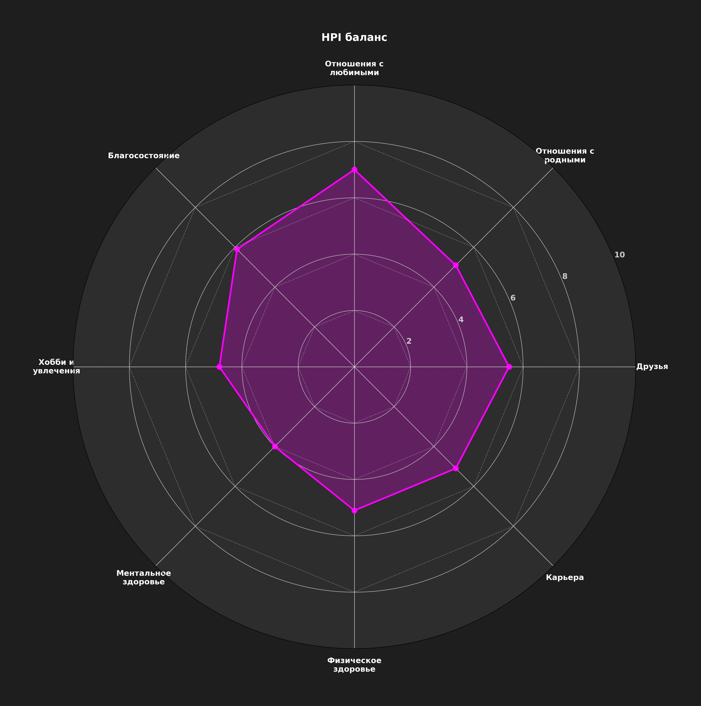

# HPI Dashboard v0.4.0

## Human Performance Index: 58.3 🟡

> [!note]- 📈 Динамика HPI
> 
>

> [!note]- ⚖️ Баланс по сферам
> 
>
> | Дата | 💖 | 🏡 | 🤝 | 💼 | ♂️ | 🧠 | 🎨 | 💰 |
> |:---|:---:|:---:|:---:|:---:|:---:|:---:|:---:|:---:|
> | 2025-06-14 | 7.0 | 5.1 | 5.5 | 5.1 | 5.1 | 4.0 | 4.8 | 5.9 |
> | 2025-06-13 | 0.0 | 5.1 | 0.0 | 5.1 | 7.0 | 4.8 | 0.0 | 5.9 |
> | 2025-06-11 | 5.9 | 3.2 | 5.5 | 3.2 | 3.6 | 3.2 | 5.1 | 4.8 |
> | 2025-06-10 | 7.8 | 4.4 | 7.0 | 3.2 | 0.0 | 4.4 | 0.0 | 4.4 |
> | 2025-06-09 | 7.8 | 4.4 | 7.0 | 3.2 | 0.0 | 4.4 | 0.0 | 4.4 |

---

## PRO-разделы

> [!example]- 🛑 Мои проблемы
> | Сфера | Проблема |
> |:---:|:---|

> [!example]- 🎯 Мои цели
> | Сфера | Цель |
> |:---:|:---|

> [!example]- 🚧 Мои блокеры
> | Сфера | Блокер |
> |:---:|:---|

> [!data]- 📊 Мои метрики
> | Сфера | Метрика | Значение | Цель | Изменение |
> |:---:|:---|:---:|:---:|:---:|
> | 💰 | Сбережения (% от дохода) | 15.0 | 25.0 |  |
> | 💰 | Пассивный доход в месяц | 10.0 | 30.0 |  |
> |  | Метрика | — | — |  |
> |  | Часов вместе в неделю | 15.0 | 25.0 |  |
> |  | Число совместных активностей | 2.0 | 4.0 |  |
> | 💼 | Часов обучения в неделю | 5.0 | 8.0 |  |
> | 💼 | Новых навыков освоено | 2.0 | 4.0 |  |
> | 🎨 | Часов на хобби в неделю | 3.0 | 6.0 |  |
> | 🎨 | Новых проектов начато | 1.0 | 2.0 |  |
> |  | Звонков родителям в неделю | 2.0 | 3.0 |  |
> |  | Семейных встреч в месяц | 1.0 | 2.0 |  |
> |  | Встреч с друзьями в месяц | 2.0 | 4.0 |  |
> |  | Новых знакомств в месяц | 1.0 | 2.0 |  |
> |  | Тренировок в неделю | 2.0 | 4.0 |  |
> |  | Средний пульс в покое | 72.0 | 65.0 |  |
> | 🧠 | Минут медитации в день | 10.0 | 20.0 |  |
> | 🧠 | Уровень стресса (1-10) | 7.0 | 4.0 |  |

> [!data]- 💡 Мои рекомендации
> | Сфера | Рекомендация |
> |:---:|:---|
> | 💰 | Финансовая стабильность: Улучшите финансовое положение. (например: Создайте финансовый план, Оптимизируйте расходы, Изучите инвестиции) |
> |  | Базовая рекомендация для сферы 💖 Отношения с любимыми: попробуйте поставить конкретную цель и сделать первый шаг. |
> | 💼 | Профессиональное развитие: Сфокусируйтесь на росте и новых навыках. (например: Составьте план развития, Изучите новую технологию/навык, Расширьте профессиональную сеть) |
> | 🎨 | Творческая реализация: Развивайте свои интересы и таланты. (например: Попробуйте новое хобби, Углубите существующие навыки, Найдите единомышленников) |
> |  | Базовая рекомендация для сферы 🏡 Отношения с родными: попробуйте поставить конкретную цель и сделать первый шаг. |
> |  | Базовая рекомендация для сферы 🤝 Друзья: попробуйте поставить конкретную цель и сделать первый шаг. |
> |  | Базовая рекомендация для сферы ♂️ Физическое здоровье: попробуйте поставить конкретную цель и сделать первый шаг. |
> | 🧠 | Ментальный баланс: Работайте над психологическим благополучием. (например: Практикуйте медитацию, Ведите дневник благодарности, Установите границы) |