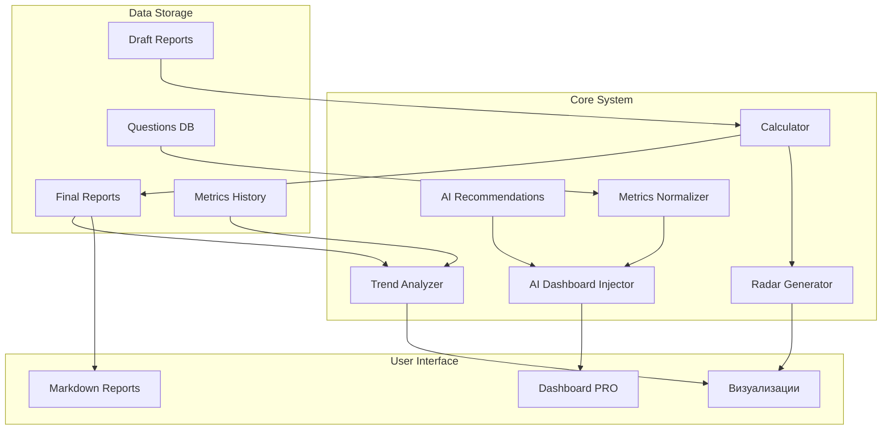

# Архитектура системы HPI

## Общая схема

## Компоненты системы

### User Interface
- **Markdown Reports**: Интерфейс для создания и редактирования отчетов в формате Markdown
- **Dashboard PRO**: Интерактивный дашборд с визуализацией метрик, рекомендациями и нормализованными данными
- **Визуализации**: Радарные диаграммы и графики трендов

### Core System
- **Calculator**: Модуль расчета HPI и метрик по сферам (`calculator.py`)
- **Radar Generator**: Генератор радарных диаграмм (`radar.py`)
- **Trend Analyzer**: Анализатор трендов и динамики показателей (`trend.py`)
- **AI Recommendations**: Движок для генерации рекомендаций (`ai_recommendations.py`)
- **AI Dashboard Injector**: Инжектор данных в PRO-дашборд (`ai_dashboard_injector.py`)
- **Metrics Normalizer**: Нормализация и стандартизация метрик

### Data Storage
- **Draft Reports**: Черновики отчетов в `reports_draft/`
- **Final Reports**: Финальные отчеты в `reports_final/`
- **Questions DB**: База вопросов и метрик в `database/questions.md`
- **Metrics History**: История изменения метрик пользователя

## Потоки данных

1. Пользователь создает черновик отчета в Markdown формате
2. Калькулятор обрабатывает данные и создает финальный отчет
3. Генератор радарных диаграмм создает визуализации
4. Анализатор трендов отслеживает динамику показателей
5. Нормализатор метрик стандартизирует названия и значения
6. AI-рекомендации анализируют данные и генерируют советы
7. AI-инжектор обновляет PRO-дашборд

## Технологический стек

- Python 3.8+
- Markdown для отчетов
- JSON для структурированных данных
- Matplotlib для визуализаций
- Git для версионирования 