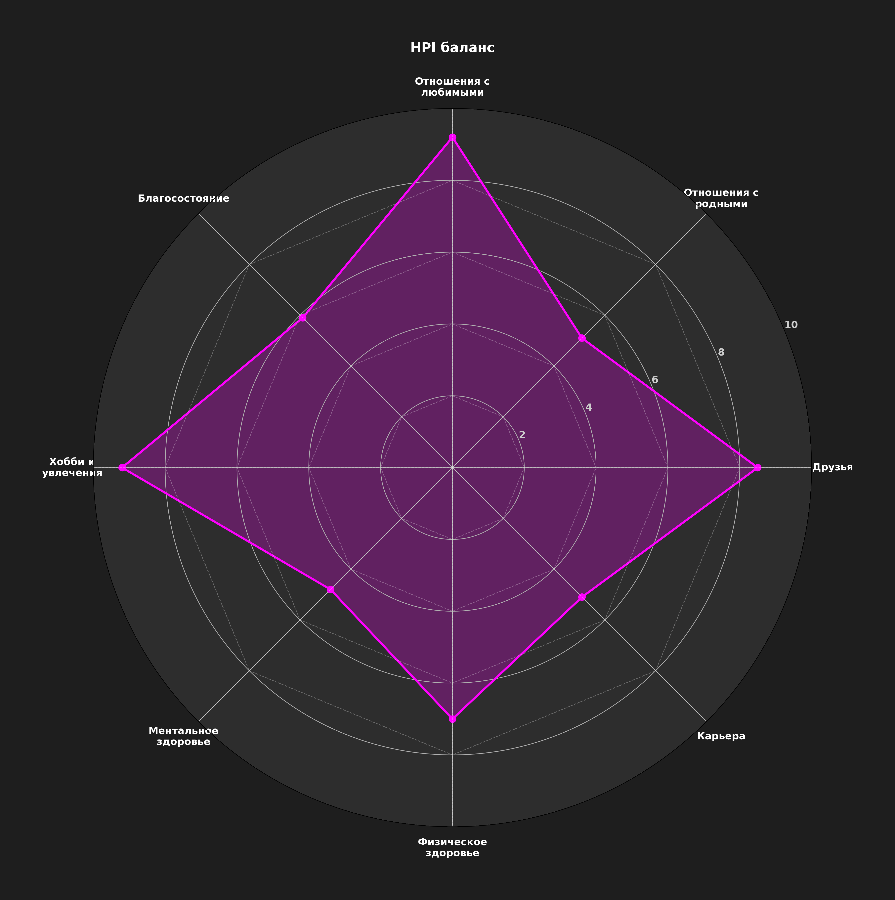

# HPI Отчет

> [!NOTE]
> Дата: 2025-06-11
> Заполните все таблицы ниже. Для вопросов по сферам используйте шкалу от 1 до 4.

---

## 1. 💖 Отношения с любимыми
| Вопрос | Варианты | Ответ |
|:---|:---|:---:|
| Частота качественного времени | 1. Менее 1 раза в неделю; 2. 1-2 раза в неделю; 3. 3-4 раза в неделю; 4. Ежедневно | 3 |
| Синхронизация жизненных целей | 1. У нас совершенно разные планы; 2. Есть частичное совпадение; 3. В основном совпадают; 4. Полностью синхронизированы | 3 |
| Решение конфликтов | 1. Частые ссоры без решения; 2. Иногда споры, но компромиссы; 3. Редкие конфликты, конструктив; 4. Практически никогда не конфликтуем | 2 |
| Поддержка в кризисах | 1. Партнёр не участвует; 2. Минимальная помощь; 3. Активно поддерживает; 4. Полная совместная работа | 4 |
| Проявление внимания и заботы | 1. Редко или никогда; 2. Иногда; 3. Часто; 4. Постоянно и разнообразно | 3 |
| Ощущение любви и принятия | 1. Совсем нет / В слабой степени; 2. В некоторой степени; 3. В значительной степени; 4. Абсолютно / Полностью | 3 |

## 2. 🏡 Отношения с родными
| Вопрос | Варианты | Ответ |
|:---|:---|:---:|
| Взаимодействие с детьми | 1. Неприменимо / Редко или нет возможности; 2. Иногда, но недостаточно; 3. Регулярно, в целом достаточно; 4. Часто и полноценно | 1 |
| Взаимодействие с родителями | 1. Неприменимо / Минимальное или отсутствует; 2. Редкое, формальное; 3. Регулярное, поддерживающее; 4. Тесное, активное участие | 2 |
| Семейные традиции | 1. Нет традиций / Не участвую; 2. Редко, формально; 3. Периодически, с удовольствием; 4. Активно создаю и поддерживаю | 2 |
| Конфликты с родными | 1. Постоянные разногласия, не решаются; 2. Частые споры, компромиссы с трудом; 3. Редкие недоразумения, решаются конструктивно; 4. Практически нет, полное взаимопонимание | 3 |
| Ощущение общности и взаимной поддержки | 1. Практически отсутствует; 2. Проявляется иногда; 3. Часто ощущаю; 4. Постоянное сильное ощущение | 2 |
| Удовлетворённость общением с другими близкими родственниками | 1. Неприменимо / Не общаюсь / Неудовлетворительно; 2. Редко, формально; 3. Периодически, тепло; 4. Часто, с удовольствием и пользой | 2 |

## 3. 🤝 Друзья
| Вопрос | Варианты | Ответ |
|:---|:---|:---:|
| Частота встреч | 1. Менее 1 раза в месяц; 2. 1-2 раза в месяц; 3. 1-2 раза в неделю; 4. 3+ раза в неделю | 2 |
| Глубина общения | 1. Поверхностные темы; 2. Личные вопросы редко; 3. Регулярно делимся переживаниями; 4. Полное взаимное доверие | 3 |
| Совместные активности | 1. Нет общих дел; 2. Пассивный отдых (кафе/кино); 3. Активные хобби (спорт/путешествия); 4. Совместные проекты/бизнес | 2 |
| Конфликты с друзьями | 1. Частые недопонимания; 2. Периодические разногласия; 3. Редкие ситуации; 4. Полное взаимопонимание | 3 |
| Поддержка от друзей в кризисах | 1. Друзья не помогают; 2. Помощь только словами; 3. Активное участие; 4. Полная всесторонняя поддержка | 3 |
| Наличие близкого друга | 1. Нет такого друга; 2. Пожалуй, нет; 3. Скорее да, есть; 4. Определенно да, есть | 4 |

## 4. 💼 Карьера
| Вопрос | Варианты | Ответ |
|:---|:---|:---:|
| Соответствие деятельности вашим ценностям | 1. Полное противоречие; 2. Частичное совпадение; 3. В основном соответствует; 4. Полная гармония | 2 |
| Удовлетворённость доходом от основной деятельности | 1. Катастрофически мало; 2. Хватает на базовые нужды; 3. Комфортный уровень; 4. Превосходит ожидания | 2 |
| Баланс основная деятельность/личная жизнь | 1. Постоянные переработки, дисбаланс; 2. Иногда задерживаюсь, баланс нарушен; 3. Чёткие границы, баланс соблюдается; 4. Полная гармония и гибкость | 1 |
| Перспективы роста и развития в вашей деятельности | 1. Карьерный тупик / нет перспектив; 2. Неясные перспективы; 3. Есть план на 1-2 года; 4. Чёткая стратегия на 5+ лет | 2 |
| Профессиональное развитие и обучение | 1. Нет обучения / развития; 2. Редкие курсы / самообучение; 3. Регулярные тренинги / обучение; 4. Системное образование / постоянное развитие | 2 |
| Ощущение признания и ценности | 1. Совсем не ценятся / Недостаточно; 2. Ценятся отчасти; 3. В основном ценятся; 4. Высоко ценятся и признаны | 2 |

## 5. ♂️ Физическое здоровье
| Вопрос | Варианты | Ответ |
|:---|:---|:---:|
| Физическая активность | 1. Малоподвижный образ жизни; 2. 1-2 тренировки в неделю; 3. 3-4 тренировки; 4. 5+ тренировок или активная работа | 2 |
| Качество сна | 1. Бессонница (<4 часов) / Очень плохое; 2. Прерывистый сон (4-6 часов) / Плохое; 3. Стабильные 6-7 часов / Удовлетворительное; 4. 8+ часов глубокого сна / Отличное | 3 |
| Качество вашего питания | 1. В основном нездоровая пища / фастфуд; 2. Часто нерегулярное, не всегда здоровое; 3. В целом регулярное и сбалансированное; 4. Полностью здоровое, сбалансированное и регулярное | 2 |
| Регулярность медицинских осмотров | 1. Более 3 лет назад / Не прохожу; 2. 1-3 года назад; 3. В течение последнего года; 4. Каждые 3-6 месяцев / Регулярно по плану | 1 |
| Общий энергетический уровень | 1. Постоянная усталость; 2. Энергии хватает до обеда; 3. Стабильный в течение дня; 4. Высокий, даже к вечеру | 2 |
| Вредные привычки | 1. Значительно ухудшают здоровье; 2. Умеренно негативно влияют; 3. Практически не влияют / Минимальное влияние; 4. Отсутствуют / Веду полностью здоровый образ жизни | 3 |

## 6. 🧠 Ментальное здоровье
| Вопрос | Варианты | Ответ |
|:---|:---|:---:|
| Уровень стресса | 1. Постоянное напряжение; 2. Частые стрессовые ситуации; 3. Редкие эпизоды; 4. Практически отсутствует | 2 |
| Практики релаксации и восстановления | 1. Нет / Не практикую; 2. 1-2 раза в месяц; 3. 1-2 раза в неделю; 4. Ежедневные практики | 2 |
| Эмоциональная устойчивость | 1. Частые срывы / Низкая; 2. Периодическая раздражительность / Средняя; 3. Ровное состояние / Высокая; 4. Абсолютное спокойствие / Очень высокая | 2 |
| Качество отдыха | 1. Нет полноценного отдыха / Низкое; 2. Редкие выходные, отдых неполноценный / Удовлетворительное; 3. Регулярные перерывы, хороший отдых / Хорошее; 4. Системный recovery-режим, отличный отдых / Отличное | 2 |
| Саморефлексия и осознанность | 1. Не анализирую свои состояния / Низкая; 2. Эпизодически / Средняя; 3. Еженедельный анализ / Высокая; 4. Ежедневные практики / Очень высокая | 2 |
| Ощущение осмысленности и целей в жизни | 1. Практически не ощущаю / Цели неясны; 2. Иногда задумываюсь, но нечетко; 3. Есть понимание целей и смысла; 4. Четко вижу смысл и активно следую целям | 3 |

## 7. 🎨 Хобби и увлечения
| Вопрос | Варианты | Ответ |
|:---|:---|:---:|
| Время на увлечения | 1. <1 часа в неделю; 2. 1-3 часа; 3. 4-6 часов; 4. 7+ часов | 2 |
| Изучение нового в рамках ваших увлечений/интересов | 1. Не изучал(а) ничего нового >1 года; 2. 1 новый навык/область за последний год; 3. 2-3 новых навыка/области; 4. Постоянно изучаю что-то новое в своих хобби | 3 |
| Ощущение потока и вовлеченности | 1. Редко или никогда; 2. Иногда; 3. Часто; 4. Почти всегда | 3 |
| Разнообразие увлечений | 1. Однообразные, мало меняющиеся; 2. Есть несколько, но хотелось бы большего разнообразия; 3. Достаточно разнообразные; 4. Многогранные интересы, постоянно пробую новое | 3 |
| Удовлетворённость от хобби | 1. Не приносит радости / Низкая; 2. Нейтрально / Средняя; 3. Периодическое удовольствие / Высокая; 4. Полное удовлетворение / Очень высокая | 3 |
| Самовыражение через хобби | 1. Практически не позволяют; 2. В малой степени; 3. В значительной степени; 4. Полностью позволяют | 3 |

## 8. 💰 Благосостояние
| Вопрос | Варианты | Ответ |
|:---|:---|:---:|
| Финансовая подушка безопасности | 1. <1 месяца расходов; 2. 1-3 месяца; 3. 4-6 месяцев; 4. >12 месяцев | 2 |
| Инвестиции и сбережения | 1. Нет / <5%; 2. 5-10%; 3. 10-20%; 4. >20% | 2 |
| Долговая нагрузка | 1. >80% дохода / Очень высокая; 2. 50-80% / Высокая; 3. 20-50% / Умеренная; 4. <20% или нет долгов / Низкая | 4 |
| Планирование и контроль бюджета | 1. Спонтанные траты / Нет контроля; 2. Примерные планы / Частичный контроль; 3. Чёткое ежемесячное планирование / Хороший контроль; 4. Автоматизированная система / Полный контроль | 2 |
| Соответствие доходов вашим финансовым целям | 1. Не хватает на базовые нужды; 2. Хватает, но без накоплений на цели; 3. Позволяет достигать большинство целей; 4. Превосходит все цели, создаёт избыток | 2 |
| Ощущение финансовой безопасности | 1. Очень не уверен(а), постоянное беспокойство; 2. Скорее не уверен(а), чем уверен(а); 3. В целом уверен(а) и спокоен(на); 4. Полностью уверен(а), финансовая стабильность | 2 |

---

---

## 🏆 Итоговые оценки HPI

| Сфера | Оценка (1-10) | Индикатор |
|:---|:---:|:---:|
| Отношения с любимыми | 5.9 | 🟡 |
| Отношения с родными | 3.2 | 🔴 |
| Друзья | 5.5 | 🟡 |
| Карьера | 3.2 | 🔴 |
| Физическое здоровье | 3.6 | 🔴 |
| Ментальное здоровье | 3.2 | 🔴 |
| Хобби и увлечения | 5.1 | 🟡 |
| Благосостояние | 4.8 | 🟡 |
| **Итоговый HPI** | **49.4** | 🟡 |
